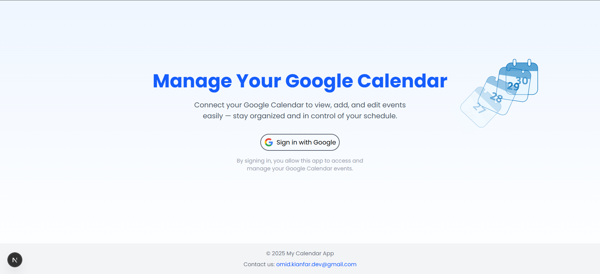
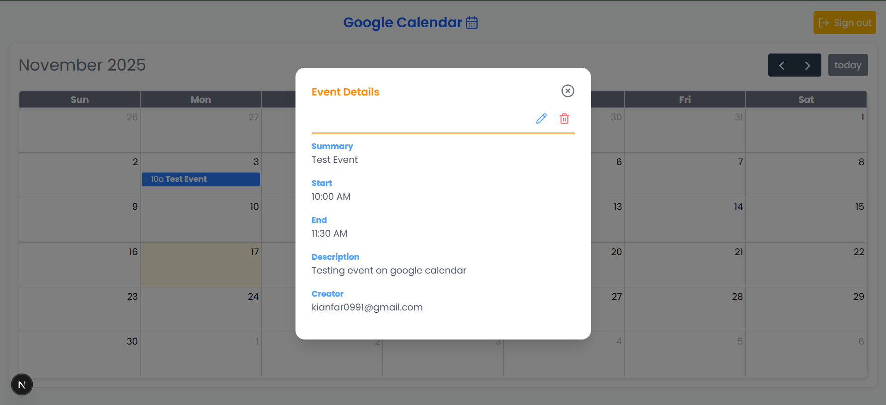

# Google Calendar App

A modern and full–featured **Google Calendar client** built with **Next.js**, **TypeScript**, and **Google OAuth**, allowing users to view, create, update, and delete calendar events through a clean UI.

This project is primarily designed for **desktop browsers** and integrates the official **Google Calendar API** via secure OAuth 2.0 authentication.

---

## 🚀 Features

* 🔐 **Google OAuth Login**
* 📅 **View Google Calendar events**
* ➕ **Create events**
* ✏️ **Edit events**
* ❌ **Delete events**
* 🔄 **Real–time event rendering** using FullCalendar
* 🎨 **Modern UI** using Tailwind CSS
* 📦 **Modular & scalable architecture**
* 🧪 **Unit tests with Jest + React Testing Library**

---

## 🖼 Screenshots

### Calendar View



### Events & Modals



---

## 🛠 Tech Stack

### **Frontend**

* Next.js (App Router)
* TypeScript
* Tailwind CSS
* FullCalendar
* React Hook Form
* Yup
* Notistack
* Day.js
* Lottie React
* Lucide Icons
* Google Fonts

### **Auth & API**

* Google OAuth 2.0 (implicit flow)
* Google Calendar API

### **Testing**

* Jest
* React Testing Library

---

## ⚙️ Installation

### 1. Clone the project

```bash
git clone https://github.com/omidKianfar/next-google-calendar-app.git
```

### 2. Install dependencies

```bash
npm install
# or
yarn install
```

### 3. Run development server

```bash
npm run dev
```

---

## 🔐 Google OAuth Setup (Required)

### 1. Go to Google Cloud Console

[https://console.cloud.google.com/](https://console.cloud.google.com/)

### 2. Create a new project

* Name: **next-google-calendar-app**

### 3. Configure OAuth consent screen

* App type: **External**
* App name: **next-google-calendar-app**
* Add your email
* Publish for testing

### 4. Create OAuth Client

* Application type: **Web Application**
* Authorized origins:

```
http://localhost:3000
```

* Authorized redirect URIs:

```
http://localhost:3000
```

### 5. Add environment variables

Create a `.env.local` file:

```env
NEXT_PUBLIC_NEXT_URL=http://localhost:3000
NEXT_PUBLIC_GOOGLE_CLIENT_ID=YOUR_CLIENT_ID
```

> These values are local and private.

### 6. Enable Google Calendar API

Google Cloud → APIs & Services → Library → **Google Calendar API** → Enable

### 7. Add Calendar API Scopes

Enable:

* `/auth/calendar`
* `/auth/calendar.events`

---

## 🧪 Running Tests

```bash
npm run test
```

---

## 🧩 Project Architecture (Interview-Friendly)

```
src
├── app
│   └── page/        → Main calendar page
├── components/          → UI components & atoms
├── hooks/
│   └── use-google-calendar.tsx
└── types/jest.d.ts               → jest types

```

### **Architecture Principles**

* 🧱 Separation of concerns (UI / logic / API)
* ♻️ Reusable components
* ⚡ Lazy-loaded modals for performance
* 🔒 OAuth logic isolated from UI
* 📌 FullCalendar inside Suspense for smoother loading

---

## 🎯 Why This Project Is Valuable (For Recruiters)

* Demonstrates advanced **React / Next.js architecture**
* Real OAuth 2.0 integration
* Works with Google Calendar API
* Includes unit testing setup
* Clean UI/UX and scalable design
* Strong example for portfolios and frontend interviews

---

## 📄 Copyright

2025
